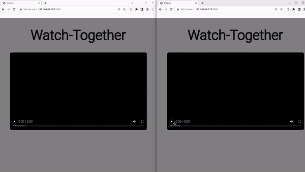
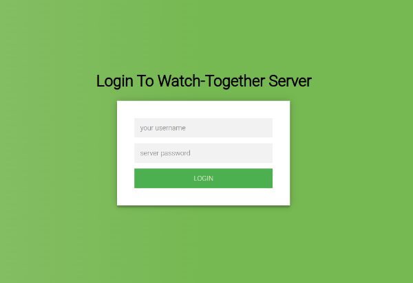

# synchronized-video-streaming

This project is a simple web application that allows users to watch videos together in real-time, ensuring a synchronized viewing experience. This project is built in Node.js, and utilizes Web-Sockets in order to send real time updates between the client and the server.

## Features
* Real-time Synchronization: All participants are watching the same video at the same time, eliminating any delays or discrepancies.
* User-friendly Interface: The web app offers an intuitive and user-friendly interface, making it easy for users to navigate and enjoy their shared video experience.
* Multi-User Support: Multiple users can join the same video session, allowing friends, family, or colleagues to watch videos together from different locations.
* Video Playback Controls: Users have full control over the video playback, including play, pause and seek, ensuring a personalized viewing experience.
* Simple Login System: A simple login page is implemented in order to allow only known people to join the hosted watch-together room.


## Installation & Usage
1. Make sure Node.js is installed. If it isn't, visit [https://nodejs.org/en/download](https://nodejs.org/en/download)
2. Clone the repository ``` git clone https://github.com/ShakedAp/synchronized-video-streaming.git```
3. Add your video to `/videos`, in `mp4` format
4. Modify `settings.json`:
    - Set `ip` to your ip
    - Set `port` to the host port (make sure it is unused)
    - Set `video_path` to the path to your video: `videos/<yourvideo>.mp4`
    - Set `password` to a string you like
5. Start the server: `npm start` or `node src/index.js`

## Screenshots
4 Clients Synchronized (gif):  


2 Clients Synchronized (gif):  


The Login Page (img):  
  
